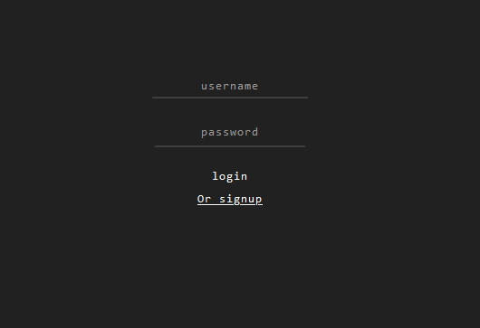
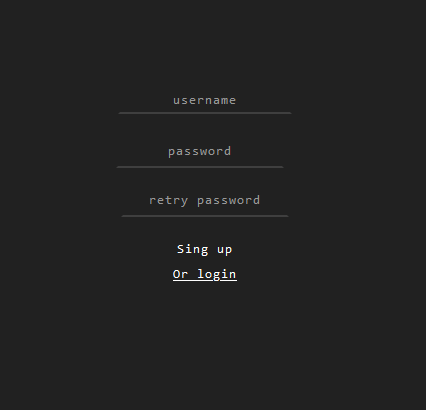
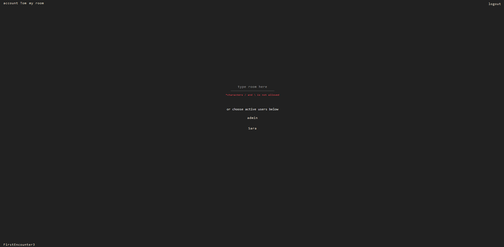
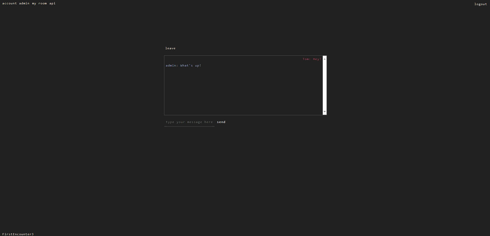
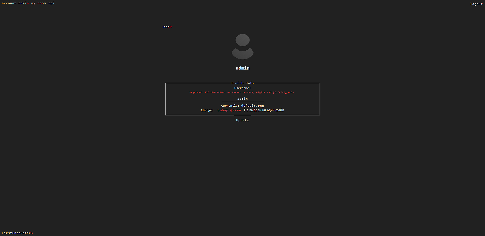
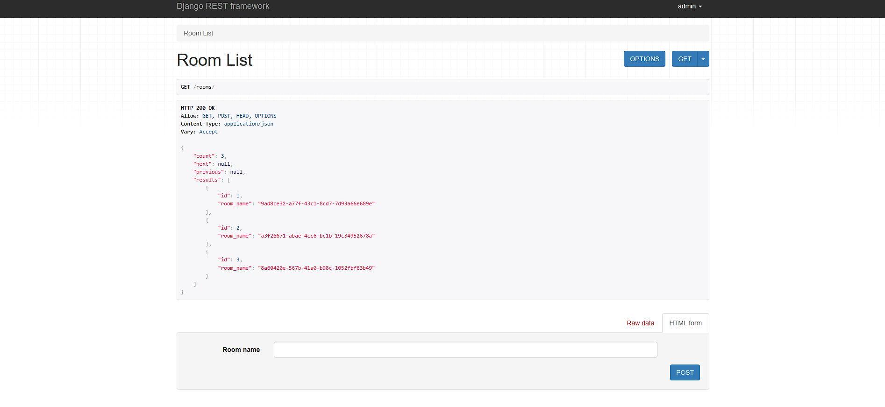
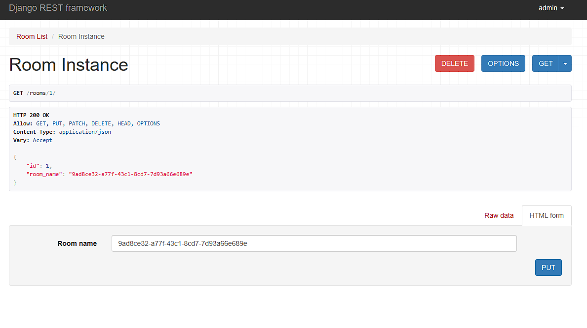

# Установка и запуск

1. Склонируйте репозиторий к себе: git clone https://github.com/FirstEncounter3/DjangoWebSocketChat.git
2. Создайте виртуальное окружение: python -m venv venv
3. Запустите виртуальное окружение: 
- Windows: venv\Scripts\activate.bat 
- Linux: source venv/bin/activate
4. Установите зависимости в виртуальное окружение: pip install - r "requirements.txt"
5. Перейдите в папку ядра проекта: cd chatapp
6. Запустите сервер: python manage.py runserver
7. Откройте браузер и в адресную строку вставьте http://127.0.0.1:8000/

# Использование

## Общие возможности

Приложение поставляется с демонстрационной базой данных. Для работы с приложением требуется вход в аккаунт.
Вы можете использовать имеющиеся демонстрационные аккаунты пользователей или зарегистрировать свой.

Для входа укажите username и password и нажмите login

Имеющиеся пользователи: 
- Username: admin; Password: admin
- Username: Tom; Password: R21t~e?%XIC~
- Username: Sara; Password: QE?mOpDagiA4

Для авторизации нажмите Or signup, где откроется форма создания аккаунта. Придумайте username, пароль 
и повторите его, чтобы исключить ошибки ввода. После авторизации можно будет войти в приложение, по аналогии выше.

На главном экране для пользователя с обычными правами будет доступно следующее:
- Ввод названия комнаты, чтобы создать новую комнату с желаемым именем
- Выбор и переход в чат с уже активными на сайте пользователями

- Переход в свою комнату по ссылке my room - это чат с теми, кто написал вам

- Переход в аккаунт пользователя по ссылке account <username>, где имеется возможность сменить имя или аватарку.
- Выход осуществляется по кнопке logout справа сверху

## Возможности пользователя с правами администратора

Создать нового пользователя с правами администратора можно: python manage.py createsuperuser 
и заполнить данные по нему. Либо воспользоваться уже созданным из демонстрационной базы

Помимо штатных возможностей каждого пользователя, администратор имеет доступ к API по соответствующей ссылке 
(она доступна только если залогиненный пользователь является администратором)

После перехода по ссылке api, откроется стандартная страница DRF, которая отобразит все уже созданные пользователями комнаты.
Здесь же, снизу, введя название комнаты, можно создать новую.

Чтобы изменить или удалить существующую комнату, добавьте к адресу http://127.0.0.1:8000/rooms/ id нужной вам комнаты, 
например http://127.0.0.1:8000/rooms/1. 
После запроса будут доступны варианты удаления или смена имени комнаты при помощи API.

